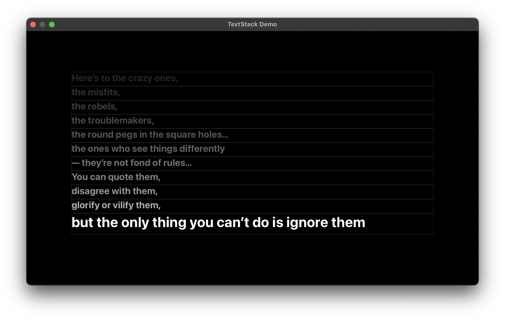

# TextStack

A Swift package for generating videos of animated stacking-up texts. It is useful for making a video of lyrics, quotes, or other texts that need to be displayed line by line.

## Usage

See test cases of the package for examples.

While each line in the demo fades out before the next one appears, this behavior is not mandatory. There can be more than one emphasized line at the same time, as long as you set a sufficiently long duration.

## Demo

The frames of lines are drawn for debugging.
